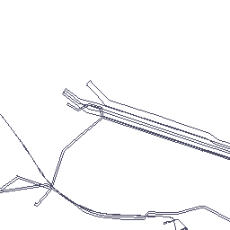

установить docker-compose

из директории запустить
`docker compose -f docker-compose.yml -p geojson2tile up -d`

проверяем

`curl --location 'http://0.0.0.0:5000'` -> `OK`

`curl --location 'http://0.0.0.0:5000/v1/upload' \
--form 'file=@"./geotestJson_tumen_v2.json"'` ->
`{
"key": "geotestJson_tumen_v2",
"message": "File 'geotestJson_tumen_v2' uploaded successfully",
"size": "1.2 Mb"
}`

`curl --location 'http://0.0.0.0:5000/v1/geotestJson_tumen_v2/13/5589/5690'` ->

для geotestJson_tumen_v2 - 
14/11186/11378
13/5589/5690
12/2791/2846
